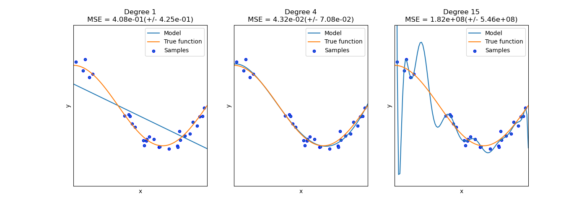

# Underfitting and Overfitting

When building models, one of the most important questions is:

> How well does the model capture the true underlying pattern in the data?

The image below illustrates three different scenarios: underfitting, good fit, and overfitting.

## Underfitting

The model on the left is **too simple**.

- It fails to capture the overall shape of the data.
- Important patterns are missed.
- The model has **high error** because it cannot represent the relationship well.

This is called **underfitting**.

> The model is not flexible enough.

---

## Good Fit

The model in the middle represents a **good fit**.

- It captures the general pattern of the data.
- It smooths over noise rather than trying to match every point.
- It balances simplicity and flexibility.

This is what we aim for in practice.

> The model captures the signal, not the noise.

---

## Overfitting

The model on the right is **too complex**.

- It tries to pass through nearly every data point.
- It captures noise instead of just the underlying pattern.
- It may look very accurate on the training data, but performs poorly on new data.

This is called **overfitting**.

> The model is too flexible—it memorizes rather than generalizes.

---

## Why This Matters

Overfitting and underfitting are two common pitfalls in modeling:

- **Underfitting** → model is too simple → poor performance everywhere  
- **Overfitting** → model is too complex → poor performance on new data  

A good model should:

- capture the main structure in the data  
- generalize well to unseen data  

---

## Key Takeaway

> The goal is not to perfectly match the data you have,  
> but to build a model that works well on data you haven’t seen.
